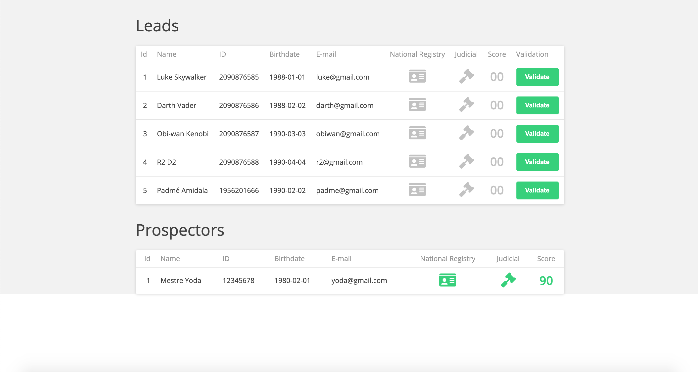

<h3 align="center">
    
    <br><br>
    <b>CRM-ADDI</b>  
    <br>
</h3>

<p align="center">
  <a>
  
  <br>
</p>

# Index

- [About](#sobre)
- [Technologies Used](#tecnologias-utilizadas)
- [How to use](#como-usar)

<a id="sobre"></a>

## :bookmark: About

Application created to test the frontend position in <strong> ADDI.</strong>


<a id="tecnologias-utilizadas"></a>

## :rocket: Technologies Used

The project was developed using the following technologies

- [TypeScript](https://www.typescriptlang.org/)
- [Node.js](https://nodejs.org/en/)
- [ReactJS](https://reactjs.org/)

## :heavy_check_mark: Result:


<h1 align="center">
    
</h1>

<a id="como-usar"></a>

## :fire: How to use


1. Make a clone :

```sh
  $ git clone https://github.com/pablomagalhaes/crm-addi.git
```

2. Running the Application:

```sh
  # Install the dependencies
  $ cd crm-addi
  $ yarn install --ignore-engines

  ## Running / Development
  $ yarn start:local

  ## Building
  $ yarn build:local
  $ yarn build:production

  # Testing
  $ yarn test:unit
 
```

## :memo: License

This project is under the MIT license. See the archive [LICENSE](LICENSE.md) for more details.

---
